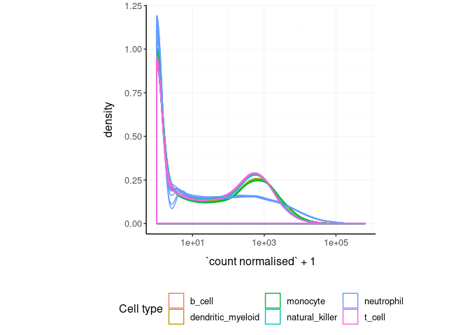
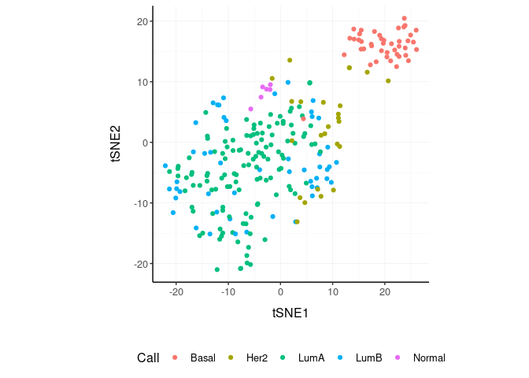
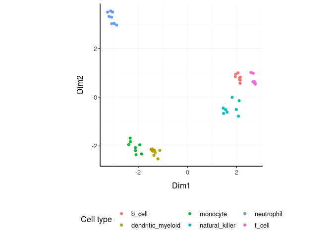
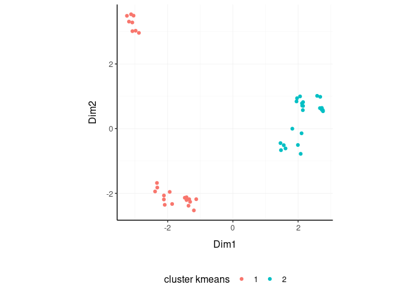
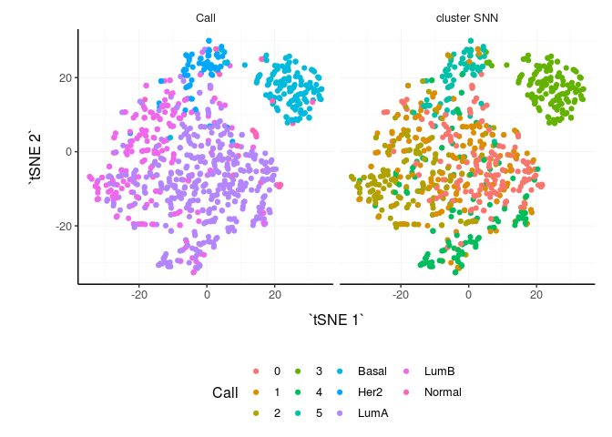

ttBulk - tidyTranscriptomics
================

<style>
.column-left{
  float: left;
  width: 49%;
  text-align: left;
   font-size: 90%;
}
.column-right{
  float: right;
  width: 49%;
  text-align: left;
  font-size: 90%;
  
}
</style>

[](https://travis-ci.org/stemangiola/ttBulk)
[](https://coveralls.io/github/stemangiola/ttBulk?branch=master)

A user-friendly grammar of bulk RNA sequencing data exploration and
processing

# 

# Introduction

ttBulk is a collection of wrapper functions for bulk tanscriptomic
analyses that follows the “tidy” paradigm. The data structure is a
tibble with columns for

  - sample identifier column
  - transcript identifier column
  - count column
  - annotation (and other info) columns

<!-- end list -->

``` r
counts = ttBulk(ttBulk::counts, sample, transcript, count)
counts_tcga = ttBulk(ttBulk::breast_tcga_mini, sample, ens, count)
counts 
```

    ## # A tibble: 1,340,160 x 6
    ##    sample     transcript   `Cell type` count time  condition
    ##    <chr>      <chr>        <chr>       <dbl> <chr> <lgl>    
    ##  1 SRR1740034 DDX11L1      b_cell         17 0 d   TRUE     
    ##  2 SRR1740034 WASH7P       b_cell       3568 0 d   TRUE     
    ##  3 SRR1740034 MIR6859-1    b_cell         57 0 d   TRUE     
    ##  4 SRR1740034 MIR1302-2    b_cell          1 0 d   TRUE     
    ##  5 SRR1740034 FAM138A      b_cell          0 0 d   TRUE     
    ##  6 SRR1740034 OR4F5        b_cell          0 0 d   TRUE     
    ##  7 SRR1740034 LOC729737    b_cell       1764 0 d   TRUE     
    ##  8 SRR1740034 LOC102725121 b_cell         11 0 d   TRUE     
    ##  9 SRR1740034 WASH9P       b_cell       3590 0 d   TRUE     
    ## 10 SRR1740034 MIR6859-2    b_cell         40 0 d   TRUE     
    ## # … with 1,340,150 more rows

In brief you can: + Going from BAM/SAM to a tidy data frame of counts
(FeatureCounts) + Adding gene symbols from ensembl IDs + Aggregating
duplicated gene symbols + Adding normalised counts + Adding principal
components + Adding MDS components + Rotating principal component or MDS
dimensions + Running differential transcript abunance analyses (edgeR) +
Adding batch adjusted counts (Combat) + Eliminating redunant samples
and/or genes + Clustering samples and/or genes with kmeans + Adding
tissue composition (Cibersort)

# Aggregate `transcripts`

ttBulk provide the `aggregate_duplicates` function to aggregate
duplicated transcripts (e.g., isoforms, ensembl). For example, we often
have to convert ensembl symbols to gene/transcript symbol, but in doing
so we have to deal with duplicates. `aggregate_duplicates` takes a
tibble and column names (as symbols; for `sample`, `transcript` and
`count`) as arguments and returns a tibble with aggregate transcript
with the same name. All the rest of the column are appended, and factors
and boolean are appended as characters.

<div class="column-left">

TidyTranscriptomics

``` r
counts.aggr = counts %>% aggregate_duplicates()
```

    ## Converted to characters
    ## condition 
    ## "logical"

</div>

<div class="column-right">

Standard procedure

``` r
temp = data.frame(
    symbol = dge_list$genes$symbol, 
    dge_list$counts
)
dge_list.nr <- by(temp, temp$symbol, 
    function(df)
        if(length(df[1,1])>0) 
            matrixStats:::colSums(as.matrix(df[,-1])) 
)
dge_list.nr <- do.call("rbind", dge_list.nr)
colnames(dge_list.nr) <- colnames(dge_list)
```

</div>

<div style="clear:both;">

</div>

# Normalise `counts`

We may want to calculate the normalised counts for library size (e.g.,
with TMM algorithm, Robinson and Oshlack
doi.org/10.1186/gb-2010-11-3-r25). `scale_abundance` takes a tibble,
column names (as symbols; for `sample`, `transcript` and `count`) and a
method as arguments and returns a tibble with additional columns with
normalised data as `<NAME OF COUNT COLUMN> normalised`.

<div class="column-left">

TidyTranscriptomics

``` r
counts.norm = counts.aggr %>% scale_abundance()
```

</div>

<div class="column-right">

Standard procedure

``` r
dgList <- calcNormFactors(dgList, method="TMM")
dgList <- estimateCommonDisp(dgList)
dgList <- estimateTagwiseDisp(dgList)
norm_counts.table <- t(
    t(dgList$pseudo.counts)*
        (dgList$samples$norm.factors)
)
```

</div>

<div style="clear:both;">

</div>

We can easily plot the normalised density to check the normalisation
outcome. On the x axis we have the log scaled counts, on the y axes we
have the density, data is grouped by sample and coloured by cell type.

``` r
counts.norm %>% 
    ggplot(aes(`count normalised` + 1, group=sample, color=`Cell type`)) +
    geom_density() + 
    scale_x_log10() +
    my_theme
```

<!-- -->

# Reduce `dimensions`

We may want to reduce the dimensions of our data, for example using PCA
or MDS algorithms. `reduce_dimensions` takes a tibble, column names (as
symbols; for `sample`, `transcript` and `count`) and a method (e.g., MDS
or PCA) as arguments and returns a tibble with additional columns for
the reduced dimensions.

**MDS** (Robinson et al., 10.1093/bioinformatics/btp616)

<div class="column-left">

TidyTranscriptomics

``` r
counts.norm.MDS =
  counts.norm %>%
  reduce_dimensions(method="MDS", .dims = 6)
```

</div>

<div class="column-right">

Standard procedure

``` r
count_m_log = log(count_m + 1) 
cmds1_2 = count_m_log %>% limma::plotMDS(dim.plot = 1:2, plot = F)
cmds3_4 = count_m_log %>% limma::plotMDS(dim.plot = 3:4, plot = F)
cmds5_6 = count_m_log %>% limma::plotMDS(dim.plot = 5:6, plot = F)


cmds = cbind(
    data.frame(cmds1_2$x, cmds1_2$y),
    cbind(
        data.frame(cmds3_4$x, cmds3_4$y),
        data.frame(cmds5_6$x, cmds5_6$y)
    )
) %>%
    setNames(sprintf("Dim %s", 1:6))
cmds$cell_type = ttBulk::counts[
    match(ttBulk::counts$sample, rownames(cmds)), 
    "Cell type"
]
```

</div>

<div style="clear:both;">

</div>

On the x and y axes axis we have the reduced dimensions 1 to 3, data is
coloured by cell
type.

``` r
counts.norm.MDS %>% select(sample, contains("Dim"), `Cell type`, time ) %>% distinct()
```

    ## # A tibble: 48 x 9
    ##    sample `Dim 1` `Dim 2` `Dim 3`  `Dim 4` `Dim 5` `Dim 6` `Cell type`
    ##    <chr>    <dbl>   <dbl>   <dbl>    <dbl>   <dbl>   <dbl> <chr>      
    ##  1 SRR17…    2.15   0.820  -3.02   0.255    0.118  -0.388  b_cell     
    ##  2 SRR17…    2.15   0.702  -3.05   0.252    0.127  -0.454  b_cell     
    ##  3 SRR17…    2.15   0.572  -2.95   0.391    0.103  -0.563  b_cell     
    ##  4 SRR17…    2.12   0.782  -2.99   0.271    0.0860 -0.310  b_cell     
    ##  5 SRR17…   -1.42  -2.21   -0.319 -0.0537  -1.18   -0.180  dendritic_…
    ##  6 SRR17…   -1.34  -2.18   -0.236 -0.00772 -1.07   -0.0937 dendritic_…
    ##  7 SRR17…   -1.36  -2.38   -0.325  0.0401  -1.35   -0.204  dendritic_…
    ##  8 SRR17…   -1.31  -2.26   -0.292  0.0236  -1.16   -0.136  dendritic_…
    ##  9 SRR17…   -2.12  -2.19   -0.204 -0.534    1.03   -0.227  monocyte   
    ## 10 SRR17…   -1.94  -1.96   -0.153 -0.676    1.02   -0.178  monocyte   
    ## # … with 38 more rows, and 1 more variable: time <chr>

``` r
counts.norm.MDS %>%
    select(contains("Dim"), sample, `Cell type`) %>%
  distinct() %>%
  GGally::ggpairs(columns = 1:6, ggplot2::aes(colour=`Cell type`))
```

<!-- -->

**PCA**

<div class="column-left">

TidyTranscriptomics

``` r
counts.norm.PCA =
  counts.norm %>%
  reduce_dimensions(method="PCA", .dims = 6)
```

    ## Getting the 500 most variable genes
    ## Fraction of variance explained by the selected principal components
    ## # A tibble: 6 x 2
    ##   `Fraction of variance`    PC
    ##                    <dbl> <int>
    ## 1                 0.420      1
    ## 2                 0.272      2
    ## 3                 0.145      3
    ## 4                 0.0809     4
    ## 5                 0.0329     5
    ## 6                 0.0247     6

</div>

<div class="column-right">

Standard procedure

``` r
count_m_log = log(count_m + 1) 
pc = count_m_log %>% prcomp(scale = TRUE)
variance = pc$sdev^2 
variance = (variance / sum(variance))[1:6] 
pc$cell_type = ttBulk::counts[
    match(ttBulk::counts$sample, rownames(pc)), 
    "Cell type"
]
```

</div>

<div style="clear:both;">

</div>

On the x and y axes axis we have the reduced dimensions 1 to 3, data is
coloured by cell
type.

``` r
counts.norm.PCA %>% select(sample, contains("PC"), `Cell type`, time ) %>% distinct()
```

    ## # A tibble: 48 x 9
    ##    sample     PC1     PC2     PC3     PC4     PC5    PC6 `Cell type`  time 
    ##    <chr>    <dbl>   <dbl>   <dbl>   <dbl>   <dbl>  <dbl> <chr>        <chr>
    ##  1 SRR174…  0.105  0.0246 -0.312  -0.120  0.0258  -0.152 b_cell       0 d  
    ##  2 SRR174…  0.104  0.0240 -0.314  -0.114  0.0171  -0.151 b_cell       1 d  
    ##  3 SRR174…  0.103  0.0189 -0.315  -0.111  0.00988 -0.155 b_cell       3 d  
    ##  4 SRR174…  0.105  0.0252 -0.313  -0.110  0.0176  -0.154 b_cell       7 d  
    ##  5 SRR174… -0.180 -0.0922 -0.129   0.114  0.0582  -0.134 dendritic_m… 0 d  
    ##  6 SRR174… -0.178 -0.106  -0.118   0.117  0.0555  -0.129 dendritic_m… 1 d  
    ##  7 SRR174… -0.177 -0.0968 -0.127   0.111  0.0616  -0.130 dendritic_m… 3 d  
    ##  8 SRR174… -0.177 -0.0985 -0.131   0.121  0.0488  -0.136 dendritic_m… 7 d  
    ##  9 SRR174… -0.201 -0.0561 -0.0864  0.0696 0.0884  -0.116 monocyte     0 d  
    ## 10 SRR174… -0.196 -0.0704 -0.0842  0.0607 0.129   -0.109 monocyte     1 d  
    ## # … with 38 more rows

``` r
counts.norm.PCA %>%
    select(contains("PC"), sample, `Cell type`) %>%
  distinct() %>%
  GGally::ggpairs(columns = 1:3, ggplot2::aes(colour=`Cell type`))
```

<!-- -->

**tSNE**

<div class="column-left">

TidyTranscriptomics

``` r
counts.norm.tSNE =
    counts_tcga%>%
    scale_abundance() %>%
    reduce_dimensions(
        method = "tSNE", 
        perplexity=10, 
        pca_scale =T
    ) 
```

    ## Getting the 500 most variable genes
    ## Performing PCA
    ## Read the 836 x 50 data matrix successfully!
    ## OpenMP is working. 1 threads.
    ## Using no_dims = 2, perplexity = 10.000000, and theta = 0.500000
    ## Computing input similarities...
    ## Building tree...
    ## Done in 0.08 seconds (sparsity = 0.054549)!
    ## Learning embedding...
    ## Iteration 50: error is 77.523664 (50 iterations in 0.16 seconds)
    ## Iteration 100: error is 74.996020 (50 iterations in 0.10 seconds)
    ## Iteration 150: error is 74.816843 (50 iterations in 0.10 seconds)
    ## Iteration 200: error is 74.745748 (50 iterations in 0.10 seconds)
    ## Iteration 250: error is 74.714131 (50 iterations in 0.10 seconds)
    ## Iteration 300: error is 1.983237 (50 iterations in 0.08 seconds)
    ## Iteration 350: error is 1.760860 (50 iterations in 0.09 seconds)
    ## Iteration 400: error is 1.692875 (50 iterations in 0.09 seconds)
    ## Iteration 450: error is 1.664520 (50 iterations in 0.10 seconds)
    ## Iteration 500: error is 1.653552 (50 iterations in 0.09 seconds)
    ## Iteration 550: error is 1.640540 (50 iterations in 0.09 seconds)
    ## Iteration 600: error is 1.631591 (50 iterations in 0.09 seconds)
    ## Iteration 650: error is 1.624956 (50 iterations in 0.09 seconds)
    ## Iteration 700: error is 1.617466 (50 iterations in 0.09 seconds)
    ## Iteration 750: error is 1.611980 (50 iterations in 0.09 seconds)
    ## Iteration 800: error is 1.606719 (50 iterations in 0.09 seconds)
    ## Iteration 850: error is 1.601315 (50 iterations in 0.08 seconds)
    ## Iteration 900: error is 1.598099 (50 iterations in 0.09 seconds)
    ## Iteration 950: error is 1.594431 (50 iterations in 0.09 seconds)
    ## Iteration 1000: error is 1.594201 (50 iterations in 0.09 seconds)
    ## Fitting performed in 1.90 seconds.

</div>

<div class="column-right">

Standard procedure

``` r
count_m_log = log(count_m + 1) 

tsne = Rtsne::Rtsne(
    t(count_m_log), 
    perplexity=10, 
        pca_scale =T
)$Y
tsne$cell_type = ttBulk::counts[
    match(ttBulk::counts$sample, rownames(tsne)), 
    "Cell type"
]
```

</div>

<div style="clear:both;">

</div>

Plot

``` r
counts.norm.tSNE %>% 
    select(contains("tSNE", ignore.case = F), sample, Call) %>%
    distinct()
```

    ## # A tibble: 836 x 4
    ##    `tSNE 1` `tSNE 2` sample                       Call  
    ##       <dbl>    <dbl> <chr>                        <fct> 
    ##  1    25.3      7.64 TCGA-A1-A0SB-01A-11R-A144-07 Normal
    ##  2    -3.40    -9.04 TCGA-A1-A0SD-01A-11R-A115-07 LumA  
    ##  3     5.02    -8.78 TCGA-A1-A0SE-01A-11R-A084-07 LumA  
    ##  4    12.5     -4.72 TCGA-A1-A0SF-01A-11R-A144-07 LumA  
    ##  5     1.55   -18.7  TCGA-A1-A0SG-01A-11R-A144-07 LumA  
    ##  6     3.34   -10.3  TCGA-A1-A0SH-01A-11R-A084-07 LumA  
    ##  7     1.03    17.1  TCGA-A1-A0SI-01A-11R-A144-07 LumB  
    ##  8    -7.72    -5.73 TCGA-A1-A0SJ-01A-11R-A084-07 LumA  
    ##  9    32.3     18.1  TCGA-A1-A0SK-01A-12R-A084-07 Basal 
    ## 10    -6.87    19.1  TCGA-A1-A0SM-01A-11R-A084-07 LumA  
    ## # … with 826 more rows

``` r
counts.norm.tSNE %>% 
    select(contains("tSNE", ignore.case = F), sample, Call) %>%
    distinct() %>%
    ggplot(aes(x = `tSNE 1`, y = `tSNE 2`, color=Call)) + geom_point() + my_theme
```

<!-- -->

# Rotate `dimensions`

We may want to rotate the reduced dimensions (or any two numeric columns
really) of our data, of a set angle. `rotate_dimensions` takes a tibble,
column names (as symbols; for `sample`, `transcript` and `count`) and an
angle as arguments and returns a tibble with additional columns for the
rotated dimensions. The rotated dimensions will be added to the original
data set as `<NAME OF DIMENSION> rotated <ANGLE>` by default, or as
specified in the input arguments.

<div class="column-left">

TidyTranscriptomics

``` r
counts.norm.MDS.rotated =
  counts.norm.MDS %>%
    rotate_dimensions(`Dim 1`, `Dim 2`, rotation_degrees = 45)
```

</div>

<div class="column-right">

Standard procedure

``` r
        rotation = function(m, d) {
            r = d * pi / 180
            ((dplyr::bind_rows(
                c(`1` = cos(r), `2` = -sin(r)),
                c(`1` = sin(r), `2` = cos(r))
            ) %>% as_matrix) %*% m)
        }
mds_r = pca %>% rotation(rotation_degrees)
mds_r$cell_type = ttBulk::counts[
    match(ttBulk::counts$sample, rownames(mds_r)), 
    "Cell type"
]
```

</div>

<div style="clear:both;">

</div>

**Original** On the x and y axes axis we have the first two reduced
dimensions, data is coloured by cell type.

``` r
counts.norm.MDS.rotated %>%
    distinct(sample, `Dim 1`,`Dim 2`, `Cell type`) %>%
    ggplot(aes(x=`Dim 1`, y=`Dim 2`, color=`Cell type` )) +
  geom_point() +
  my_theme
```

<!-- -->

**Rotated** On the x and y axes axis we have the first two reduced
dimensions rotated of 45 degrees, data is coloured by cell type.

``` r
counts.norm.MDS.rotated %>%
    distinct(sample, `Dim 1 rotated 45`,`Dim 2 rotated 45`, `Cell type`) %>%
    ggplot(aes(x=`Dim 1 rotated 45`, y=`Dim 2 rotated 45`, color=`Cell type` )) +
  geom_point() +
  my_theme
```

<!-- -->

# Test `differential transcription`

We may want to test for differential transcription between sample-wise
factors of interest (e.g., with edgeR). `test_differential_abundance`
takes a tibble, column names (as symbols; for `sample`, `transcript` and
`count`) and a formula representing the desired linear model as
arguments and returns a tibble with additional columns for the
statistics from the hypothesis test (e.g., log fold change, p-value and
false discovery rate).

<div class="column-left">

TidyTranscriptomics

``` r
counts %>%
    test_differential_abundance( ~ condition, action="get")
```

    ## # A tibble: 27,920 x 8
    ##    transcript   logFC logCPM    LR   PValue      FDR is_de `filter out low…
    ##    <chr>        <dbl>  <dbl> <dbl>    <dbl>    <dbl> <lgl> <lgl>           
    ##  1 ANKRD18DP     4.82 -0.995 122.  1.88e-28 2.97e-24 TRUE  FALSE           
    ##  2 SCIN          4.83 -0.463 113.  2.07e-26 1.64e-22 TRUE  FALSE           
    ##  3 IGLL3P        5.34 -0.623  89.5 3.13e-21 1.65e-17 TRUE  FALSE           
    ##  4 RNGTT         2.36  4.74   60.7 6.67e-15 2.63e-11 TRUE  FALSE           
    ##  5 LOC1019293…   2.90  0.612  54.5 1.54e-13 4.86e-10 TRUE  FALSE           
    ##  6 STAG3         2.55  3.21   52.9 3.58e-13 9.43e-10 TRUE  FALSE           
    ##  7 GIMAP4      -11.0   7.71   51.2 8.26e-13 1.87e- 9 TRUE  FALSE           
    ##  8 GRAMD1B      -5.87  4.20   43.3 4.61e-11 8.95e- 8 TRUE  FALSE           
    ##  9 BTNL9         6.34  3.83   43.1 5.09e-11 8.95e- 8 TRUE  FALSE           
    ## 10 SMIM3        -9.55  3.52   40.9 1.62e-10 2.56e- 7 TRUE  FALSE           
    ## # … with 27,910 more rows

</div>

<div class="column-right">

Standard procedure

``` r
design =
        model.matrix(
            object = .formula,
            data = df_for_edgeR %>% select(!!.sample, one_of(parse_formula(.formula))) %>% distinct %>% arrange(!!.sample)
        ) %>%
        magrittr::set_colnames(c("(Intercept)",
                                                         (.) %>% colnames %>% `[` (-1)))

edgeR::DGEList(counts = .) %>%
        edgeR::calcNormFactors(method = "TMM") %>%
        edgeR::estimateGLMCommonDisp(design) %>%
        edgeR::estimateGLMTagwiseDisp(design) %>%
        edgeR::glmFit(design) %>%
        edgeR::glmLRT(coef = 2) %>%
        edgeR::topTags(n = 999999) %$%
        table
```

</div>

<div style="clear:both;">

</div>

# Adjust `counts`

We may want to adjust `counts` for (known) unwanted variation.
`adjust_abundance` takes as arguments a tibble, column names (as
symbols; for `sample`, `transcript` and `count`) and a formula
representing the desired linear model where the first covariate is the
factor of interest and the second covariate is the unwanted variation,
and returns a tibble with additional columns for the adjusted counts as
`<COUNT COLUMN> adjusted`. At the moment just an unwanted covariated is
allowed at a time.

``` r
counts.norm.adj =
    counts.norm %>%

      # Add fake batch and factor of interest
      left_join(
        (.) %>%
            distinct(sample) %>%
            mutate(batch = sample(0:1, n(), replace = T))
      ) %>%
        mutate(factor_of_interest = `Cell type` == "b_cell") %>%

      # Add covariate
      adjust_abundance(
        ~ factor_of_interest + batch,
        action = "get"
      )
```

    ## Standardizing Data across genes

``` r
counts.norm.adj
```

    ## # A tibble: 1,340,160 x 4
    ##    transcript sample     `count normalised adjusted` `filter out low count…
    ##    <chr>      <chr>                            <int> <lgl>                 
    ##  1 A1BG       SRR1740034                         130 FALSE                 
    ##  2 A1BG-AS1   SRR1740034                          71 FALSE                 
    ##  3 A1CF       SRR1740034                          NA TRUE                  
    ##  4 A2M        SRR1740034                           0 FALSE                 
    ##  5 A2M-AS1    SRR1740034                           0 FALSE                 
    ##  6 A2ML1      SRR1740034                           2 FALSE                 
    ##  7 A2MP1      SRR1740034                          NA TRUE                  
    ##  8 A3GALT2    SRR1740034                           0 FALSE                 
    ##  9 A4GALT     SRR1740034                          NA TRUE                  
    ## 10 A4GNT      SRR1740034                          NA TRUE                  
    ## # … with 1,340,150 more rows

# Annotate `Cell type composition`

We may want to infer the cell type composition of our samples (with the
algorithm Cibersort; Newman et al., 10.1038/nmeth.3337).
`deconvolve_cellularity` takes as arguments a tibble, column names (as
symbols; for `sample`, `transcript` and `count`) and returns a tibble
with additional columns for the adjusted cell type proportions.

**columns truncated**

``` r
counts.cibersort =
    counts %>%
    deconvolve_cellularity(action="add", cores=2)

counts.cibersort %>% select(sample, contains("type:")) %>% distinct()
```

    ## # A tibble: 48 x 23
    ##    sample `type: B cells … `type: B cells … `type: Plasma c…
    ##    <chr>             <dbl>            <dbl>            <dbl>
    ##  1 SRR17…            0.632          0.247                  0
    ##  2 SRR17…            0.656          0.235                  0
    ##  3 SRR17…            0.620          0.245                  0
    ##  4 SRR17…            0.586          0.287                  0
    ##  5 SRR17…            0              0.0177                 0
    ##  6 SRR17…            0              0.0133                 0
    ##  7 SRR17…            0              0.00699                0
    ##  8 SRR17…            0              0                      0
    ##  9 SRR17…            0              0                      0
    ## 10 SRR17…            0              0                      0
    ## # … with 38 more rows, and 19 more variables: `type: T cells CD8` <dbl>,
    ## #   `type: T cells CD4 naive` <dbl>, `type: T cells CD4 memory
    ## #   resting` <dbl>, `type: T cells CD4 memory activated` <dbl>, `type: T
    ## #   cells follicular helper` <dbl>, `type: T cells regulatory
    ## #   (Tregs)` <dbl>, `type: T cells gamma delta` <dbl>, `type: NK cells
    ## #   resting` <dbl>, `type: NK cells activated` <dbl>, `type:
    ## #   Monocytes` <dbl>, `type: Macrophages M0` <dbl>, `type: Macrophages
    ## #   M1` <dbl>, `type: Macrophages M2` <dbl>, `type: Dendritic cells
    ## #   resting` <dbl>, `type: Dendritic cells activated` <dbl>, `type: Mast
    ## #   cells resting` <dbl>, `type: Mast cells activated` <dbl>, `type:
    ## #   Eosinophils` <dbl>, `type: Neutrophils` <dbl>

With the new annotated data frame, we can plot the distributions of cell
types across samples, and compare them with the nominal cell type labels
to check for the purity of isolation. On the x axis we have the cell
types inferred by Cibersort, on the y axis we have the inferred
proportions. The data is facetted and coloured by nominal cell types
(annotation given by the researcher after FACS sorting).

``` r
counts.cibersort %>%
    select(contains("type:"), everything()) %>%
    gather(`Cell type inferred`, `proportion`, 1:22) %>%
  distinct(sample, `Cell type`, `Cell type inferred`, proportion) %>%
  ggplot(aes(x=`Cell type inferred`, y=proportion, fill=`Cell type`)) +
  geom_boxplot() +
  facet_wrap(~`Cell type`) +
  my_theme +
  theme(axis.text.x = element_text(angle = 90, hjust = 1, vjust = 0.5), aspect.ratio=1/5)
```

<!-- -->

# Annotate `clusters`

We may want to cluster our data (e.g., using k-means sample-wise).
`cluster_elements` takes as arguments a tibble, column names (as
symbols; for `sample`, `transcript` and `count`) and returns a tibble
with additional columns for the cluster annotation. At the moment only
k-means clustering is supported, the plan is to introduce more
clustering methods.

**k-means**

``` r
counts.norm.cluster = counts.norm.MDS %>%
  cluster_elements(method="kmeans", centers = 2 )

counts.norm.cluster
```

    ## # A tibble: 1,340,160 x 18
    ##    sample transcript `Cell type` count time  condition `merged transcr…
    ##    <chr>  <chr>      <chr>       <dbl> <chr> <chr>                <dbl>
    ##  1 SRR17… A1BG       b_cell        153 0 d   TRUE                     1
    ##  2 SRR17… A1BG-AS1   b_cell         83 0 d   TRUE                     1
    ##  3 SRR17… A1CF       b_cell          1 0 d   TRUE                     1
    ##  4 SRR17… A2M        b_cell          1 0 d   TRUE                     1
    ##  5 SRR17… A2M-AS1    b_cell          0 0 d   TRUE                     1
    ##  6 SRR17… A2ML1      b_cell          3 0 d   TRUE                     1
    ##  7 SRR17… A2MP1      b_cell          0 0 d   TRUE                     1
    ##  8 SRR17… A3GALT2    b_cell          0 0 d   TRUE                     1
    ##  9 SRR17… A4GALT     b_cell          4 0 d   TRUE                     1
    ## 10 SRR17… A4GNT      b_cell          0 0 d   TRUE                     1
    ## # … with 1,340,150 more rows, and 11 more variables: `count
    ## #   normalised` <dbl>, TMM <dbl>, multiplier <dbl>, `filter out low
    ## #   counts` <lgl>, `Dim 1` <dbl>, `Dim 2` <dbl>, `Dim 3` <dbl>, `Dim
    ## #   4` <dbl>, `Dim 5` <dbl>, `Dim 6` <dbl>, `cluster kmeans` <fct>

We can add cluster annotation to the MDS dimesion reduced data set and
plot.

``` r
 counts.norm.cluster %>%
    distinct(sample, `Dim 1`, `Dim 2`, `cluster kmeans`) %>%
    ggplot(aes(x=`Dim 1`, y=`Dim 2`, color=`cluster kmeans`)) +
  geom_point() +
  my_theme
```

<!-- -->

**SNN**

``` r
counts.norm.SNN =
    counts.norm.tSNE %>%
    cluster_elements(method = "SNN")
```

    ## Modularity Optimizer version 1.3.0 by Ludo Waltman and Nees Jan van Eck
    ## 
    ## Number of nodes: 836
    ## Number of edges: 28808
    ## 
    ## Running Louvain algorithm...
    ## Maximum modularity in 10 random starts: 0.6717
    ## Number of communities: 6
    ## Elapsed time: 0 seconds

``` r
counts.norm.SNN %>% 
    select(contains("tSNE", ignore.case = F), `cluster SNN`, sample) %>%
    distinct()
```

    ## # A tibble: 836 x 4
    ##    `tSNE 1` `tSNE 2` `cluster SNN` sample                      
    ##       <dbl>    <dbl> <fct>         <chr>                       
    ##  1    25.3      7.64 3             TCGA-A1-A0SB-01A-11R-A144-07
    ##  2    -3.40    -9.04 0             TCGA-A1-A0SD-01A-11R-A115-07
    ##  3     5.02    -8.78 4             TCGA-A1-A0SE-01A-11R-A084-07
    ##  4    12.5     -4.72 1             TCGA-A1-A0SF-01A-11R-A144-07
    ##  5     1.55   -18.7  2             TCGA-A1-A0SG-01A-11R-A144-07
    ##  6     3.34   -10.3  0             TCGA-A1-A0SH-01A-11R-A084-07
    ##  7     1.03    17.1  0             TCGA-A1-A0SI-01A-11R-A144-07
    ##  8    -7.72    -5.73 2             TCGA-A1-A0SJ-01A-11R-A084-07
    ##  9    32.3     18.1  3             TCGA-A1-A0SK-01A-12R-A084-07
    ## 10    -6.87    19.1  5             TCGA-A1-A0SM-01A-11R-A084-07
    ## # … with 826 more rows

``` r
counts.norm.SNN %>% 
    select(contains("tSNE", ignore.case = F), `cluster SNN`, sample, Call) %>%
    gather(source, Call, c("cluster SNN", "Call")) %>%
    distinct() %>%
    ggplot(aes(x = `tSNE 1`, y = `tSNE 2`, color=Call)) + geom_point() + facet_grid(~source) + my_theme
```

<!-- -->

``` r
# Do differential transcription between clusters
counts.norm.SNN %>%
    mutate(factor_of_interest = `cluster SNN` == 3) %>%
    test_differential_abundance(
    ~ factor_of_interest,
    action="get"
   )
```

    ## # A tibble: 3,000 x 8
    ##    ens      logFC logCPM    LR    PValue       FDR is_de `filter out low c…
    ##    <chr>    <dbl>  <dbl> <dbl>     <dbl>     <dbl> <lgl> <lgl>             
    ##  1 ENSG000…  5.51   4.45 2341. 0.        0.        TRUE  FALSE             
    ##  2 ENSG000…  5.31   3.15 1833. 0.        0.        TRUE  FALSE             
    ##  3 ENSG000…  4.29   5.53 2862. 0.        0.        TRUE  FALSE             
    ##  4 ENSG000…  3.38   5.72 1709. 0.        0.        TRUE  FALSE             
    ##  5 ENSG000…  1.88   7.46 1916. 0.        0.        TRUE  FALSE             
    ##  6 ENSG000…  3.05   5.43 1435. 4.62e-314 2.31e-311 TRUE  FALSE             
    ##  7 ENSG000…  5.90   4.12 1418. 3.13e-310 1.34e-307 TRUE  FALSE             
    ##  8 ENSG000…  4.44   4.37 1357. 4.69e-297 1.76e-294 TRUE  FALSE             
    ##  9 ENSG000…  2.75   8.26 1250. 7.96e-274 2.65e-271 TRUE  FALSE             
    ## 10 ENSG000…  2.28   7.01 1177. 5.13e-258 1.53e-255 TRUE  FALSE             
    ## # … with 2,990 more rows

# Drop `redundant`

We may want to remove redundant elements from the original data set
(e.g., samples or transcripts), for example if we want to define
cell-type specific signatures with low sample redundancy.
`remove_redundancy` takes as arguments a tibble, column names (as
symbols; for `sample`, `transcript` and `count`) and returns a tibble
dropped recundant elements (e.g., samples). Two redundancy estimation
approaches are supported:

  - removal of highly correlated clusters of elements (keeping a
    representative) with method=“correlation”
  - removal of most proximal element pairs in a reduced dimensional
    space.

**Approach 1**

``` r
counts.norm.non_redundant =
    counts.norm.MDS %>%
  remove_redundancy(    method = "correlation" )
```

We can visualise how the reduced redundancy with the reduced dimentions
look like

``` r
counts.norm.non_redundant %>%
    distinct(sample, `Dim 1`, `Dim 2`, `Cell type`) %>%
    ggplot(aes(x=`Dim 1`, y=`Dim 2`, color=`Cell type`)) +
  geom_point() +
  my_theme
```

<!-- -->

**Approach 2**

``` r
counts.norm.non_redundant =
    counts.norm.MDS %>%
  remove_redundancy(
    method = "reduced_dimensions",
    Dim_a_column = `Dim 1`,
    Dim_b_column = `Dim 2`
  )
```

We can visualise MDS reduced dimensions of the samples with the closest
pair removed.

``` r
counts.norm.non_redundant %>%
    distinct(sample, `Dim 1`, `Dim 2`, `Cell type`) %>%
    ggplot(aes(x=`Dim 1`, y=`Dim 2`, color=`Cell type`)) +
  geom_point() +
  my_theme
```

<!-- -->

# Other useful wrappers

The above wrapper streamline the most common processing of bulk RNA
sequencing data. Other useful wrappers are listed above.

## From BAM/SAM to tibble of gene counts

We can calculate gene counts (using FeatureCounts; Liao Y et al.,
10.1093/nar/gkz114) from a list of BAM/SAM files and format them into a
tidy structure (similar to counts).

``` r
counts = bam_sam_to_featureCounts_tibble(
    file_names, 
    genome = "hg38",
    isPairedEnd = T,
    requireBothEndsMapped = T,
    checkFragLength = F,
    useMetaFeatures = T
)
```

## From ensembl IDs to gene symbol IDs

We can add gene symbols from ensembl identifiers. This is useful since
different resources use ensembl IDs while others use gene symbol IDs.

``` r
counts_ensembl %>% annotate_symbol(ens)
```

    ## # A tibble: 119 x 8
    ##    ens   iso   `read count` sample cases_0_project… cases_0_samples…
    ##    <chr> <chr>        <dbl> <chr>  <chr>            <chr>           
    ##  1 ENSG… 13             144 TARGE… Acute Myeloid L… Primary Blood D…
    ##  2 ENSG… 13              72 TARGE… Acute Myeloid L… Primary Blood D…
    ##  3 ENSG… 13               0 TARGE… Acute Myeloid L… Primary Blood D…
    ##  4 ENSG… 13            1099 TARGE… Acute Myeloid L… Primary Blood D…
    ##  5 ENSG… 13              11 TARGE… Acute Myeloid L… Primary Blood D…
    ##  6 ENSG… 13               2 TARGE… Acute Myeloid L… Primary Blood D…
    ##  7 ENSG… 13               3 TARGE… Acute Myeloid L… Primary Blood D…
    ##  8 ENSG… 13            2678 TARGE… Acute Myeloid L… Primary Blood D…
    ##  9 ENSG… 13             751 TARGE… Acute Myeloid L… Primary Blood D…
    ## 10 ENSG… 13               1 TARGE… Acute Myeloid L… Primary Blood D…
    ## # … with 109 more rows, and 2 more variables: transcript <chr>, hg <chr>

# ADD versus GET modes

Every function takes this structure as input, and outputs either (i) the
new information joint to the original input data frame (default), or
(ii) just the new information, setting action=“add” or action=“get”
respectively. For example, from this data set

``` r
  counts.norm 
```

    ## # A tibble: 1,340,160 x 11
    ##    sample transcript `Cell type` count time  condition `merged transcr…
    ##    <chr>  <chr>      <chr>       <dbl> <chr> <chr>                <dbl>
    ##  1 SRR17… A1BG       b_cell        153 0 d   TRUE                     1
    ##  2 SRR17… A1BG-AS1   b_cell         83 0 d   TRUE                     1
    ##  3 SRR17… A1CF       b_cell          1 0 d   TRUE                     1
    ##  4 SRR17… A2M        b_cell          1 0 d   TRUE                     1
    ##  5 SRR17… A2M-AS1    b_cell          0 0 d   TRUE                     1
    ##  6 SRR17… A2ML1      b_cell          3 0 d   TRUE                     1
    ##  7 SRR17… A2MP1      b_cell          0 0 d   TRUE                     1
    ##  8 SRR17… A3GALT2    b_cell          0 0 d   TRUE                     1
    ##  9 SRR17… A4GALT     b_cell          4 0 d   TRUE                     1
    ## 10 SRR17… A4GNT      b_cell          0 0 d   TRUE                     1
    ## # … with 1,340,150 more rows, and 4 more variables: `count
    ## #   normalised` <dbl>, TMM <dbl>, multiplier <dbl>, `filter out low
    ## #   counts` <lgl>

**action=“add”** (Default) We can add the MDS dimensions to the original
data set

``` r
  counts.norm %>%
    reduce_dimensions(
        .abundance = `count normalised`, 
        method="MDS" , 
        .element = sample, 
        .feature = transcript, 
        .dims = 3, 
        action="add"
    )
```

    ## # A tibble: 1,340,160 x 14
    ##    sample transcript `Cell type` count time  condition `merged transcr…
    ##    <chr>  <chr>      <chr>       <dbl> <chr> <chr>                <dbl>
    ##  1 SRR17… A1BG       b_cell        153 0 d   TRUE                     1
    ##  2 SRR17… A1BG-AS1   b_cell         83 0 d   TRUE                     1
    ##  3 SRR17… A1CF       b_cell          1 0 d   TRUE                     1
    ##  4 SRR17… A2M        b_cell          1 0 d   TRUE                     1
    ##  5 SRR17… A2M-AS1    b_cell          0 0 d   TRUE                     1
    ##  6 SRR17… A2ML1      b_cell          3 0 d   TRUE                     1
    ##  7 SRR17… A2MP1      b_cell          0 0 d   TRUE                     1
    ##  8 SRR17… A3GALT2    b_cell          0 0 d   TRUE                     1
    ##  9 SRR17… A4GALT     b_cell          4 0 d   TRUE                     1
    ## 10 SRR17… A4GNT      b_cell          0 0 d   TRUE                     1
    ## # … with 1,340,150 more rows, and 7 more variables: `count
    ## #   normalised` <dbl>, TMM <dbl>, multiplier <dbl>, `filter out low
    ## #   counts` <lgl>, `Dim 1` <dbl>, `Dim 2` <dbl>, `Dim 3` <dbl>

**action=“get”** We can get just the MDS dimensions relative to each
sample

``` r
  counts.norm %>%
    reduce_dimensions(
        .abundance = `count normalised`, 
        method="MDS" , 
        .element = sample, 
        .feature = transcript, 
        .dims = 3, 
        action="get"
    )
```

    ## # A tibble: 48 x 4
    ##    sample     `Dim 1` `Dim 2` `Dim 3`
    ##    <chr>        <dbl>   <dbl>   <dbl>
    ##  1 SRR1740034    2.31   0.491 -3.01  
    ##  2 SRR1740035    2.29   0.427 -3.03  
    ##  3 SRR1740036    2.25   0.388 -2.92  
    ##  4 SRR1740037    2.29   0.420 -2.98  
    ##  5 SRR1740038   -1.46  -2.12  -0.163 
    ##  6 SRR1740039   -1.38  -2.17  -0.0592
    ##  7 SRR1740040   -1.42  -2.12  -0.199 
    ##  8 SRR1740041   -1.35  -2.18  -0.127 
    ##  9 SRR1740042   -2.13  -2.05  -0.0695
    ## 10 SRR1740043   -1.95  -1.96   0.0121
    ## # … with 38 more rows
