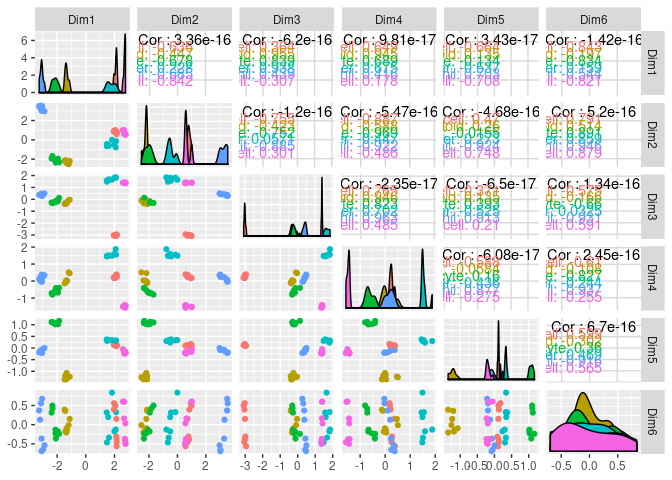
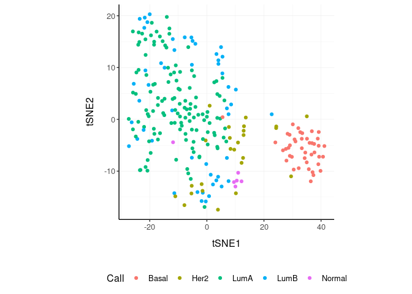
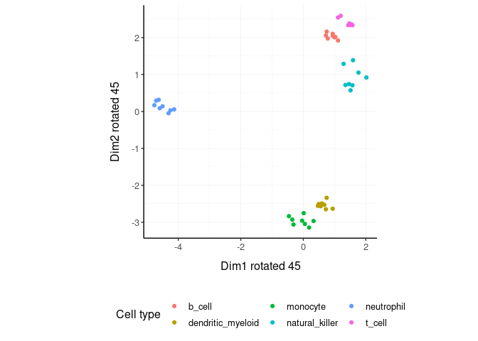
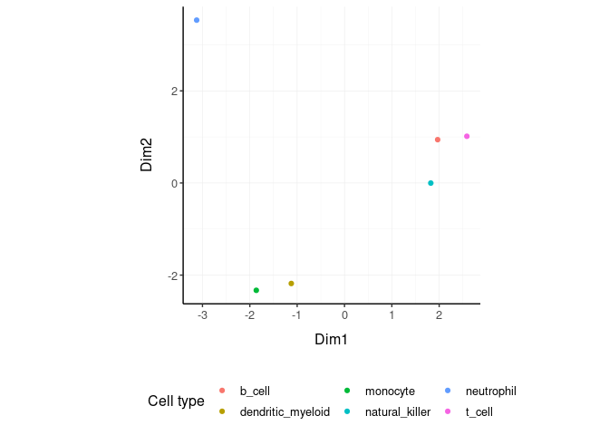
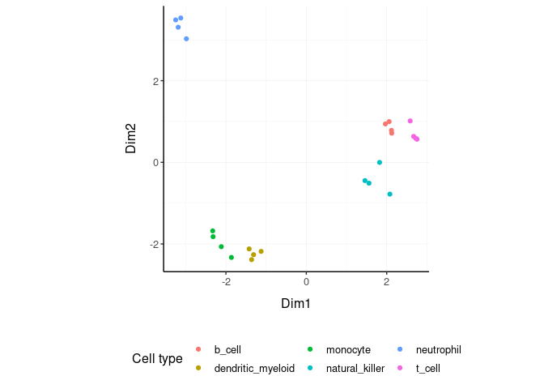

ttBulk - part of tidyTranscriptomics
================

<!---

[](https://travis-ci.org/stemangiola/ttBulk) [](https://coveralls.io/github/stemangiola/ttBulk?branch=master)

-->

A tidy and user-friendly grammar of bulk RNA sequencing data exploration
and analysis

# 

# Installation

Due to Bioconductor submission requiring R \>= 4.0 you need to install
the **dev** branch

``` r
devtools::install_github("stemangiola/ttBulk@dev")
```

# Introduction

ttBulk is a collection of wrapper functions for bulk tanscriptomic
analyses that follows the “tidy” paradigm. The data structure is a
tibble with columns for

  - sample identifier column
  - transcript identifier column
  - count column
  - annotation (and other info) columns

<!-- end list -->

``` r
counts = ttBulk(ttBulk::counts, sample, transcript, count)
counts_tcga = ttBulk(ttBulk::breast_tcga_mini, sample, ens, count)
counts 
```

    ## # A tibble: 1,340,160 x 8
    ##    sample   transcript  `Cell type` count time  condition batch factor_of_inter…
    ##    <chr>    <chr>       <chr>       <dbl> <chr> <lgl>     <int> <lgl>           
    ##  1 SRR1740… DDX11L1     b_cell         17 0 d   TRUE          0 TRUE            
    ##  2 SRR1740… WASH7P      b_cell       3568 0 d   TRUE          0 TRUE            
    ##  3 SRR1740… MIR6859-1   b_cell         57 0 d   TRUE          0 TRUE            
    ##  4 SRR1740… MIR1302-2   b_cell          1 0 d   TRUE          0 TRUE            
    ##  5 SRR1740… FAM138A     b_cell          0 0 d   TRUE          0 TRUE            
    ##  6 SRR1740… OR4F5       b_cell          0 0 d   TRUE          0 TRUE            
    ##  7 SRR1740… LOC729737   b_cell       1764 0 d   TRUE          0 TRUE            
    ##  8 SRR1740… LOC1027251… b_cell         11 0 d   TRUE          0 TRUE            
    ##  9 SRR1740… WASH9P      b_cell       3590 0 d   TRUE          0 TRUE            
    ## 10 SRR1740… MIR6859-2   b_cell         40 0 d   TRUE          0 TRUE            
    ## # … with 1,340,150 more rows

In brief you can: + Going from BAM/SAM to a tidy data frame of counts
(FeatureCounts) + Adding gene symbols from ensembl IDs + Aggregating
duplicated gene symbols + Adding normalised counts + Adding principal
components + Adding MDS components + Rotating principal component or MDS
dimensions + Running differential transcript abunance analyses (edgeR) +
Adding batch adjusted counts (Combat) + Eliminating redunant samples
and/or genes + Clustering samples and/or genes with kmeans + Adding
tissue composition (Cibersort)

# Aggregate duplicated `transcripts`

ttBulk provide the `aggregate_duplicates` function to aggregate
duplicated transcripts (e.g., isoforms, ensembl). For example, we often
have to convert ensembl symbols to gene/transcript symbol, but in doing
so we have to deal with duplicates. `aggregate_duplicates` takes a
tibble and column names (as symbols; for `sample`, `transcript` and
`count`) as arguments and returns a tibble with aggregate transcript
with the same name. All the rest of the column are appended, and factors
and boolean are appended as characters.

<div class="column-left">

TidyTranscriptomics

``` r yellow
counts.aggr = counts %>% aggregate_duplicates()
```

</div>

<div class="column-right">

Standard procedure

``` r
temp = data.frame(
    symbol = dge_list$genes$symbol, 
    dge_list$counts
)
dge_list.nr <- by(temp, temp$symbol, 
    function(df)
        if(length(df[1,1])>0) 
            matrixStats:::colSums(as.matrix(df[,-1])) 
)
dge_list.nr <- do.call("rbind", dge_list.nr)
colnames(dge_list.nr) <- colnames(dge_list)
```

</div>

<div style="clear:both;">

</div>

# Scale `counts`

We may want to calculate the normalised counts for library size (e.g.,
with TMM algorithm, Robinson and Oshlack
doi.org/10.1186/gb-2010-11-3-r25). `scale_abundance` takes a tibble,
column names (as symbols; for `sample`, `transcript` and `count`) and a
method as arguments and returns a tibble with additional columns with
normalised data as `<NAME OF COUNT COLUMN> normalised`.

<div class="column-left">

TidyTranscriptomics

``` r
counts.norm = counts.aggr %>% scale_abundance()
```

</div>

<div class="column-right">

Standard procedure

``` r
library(edgeR)

myCPM <- cpm(count_m)
keep <- rowSums(myCPM > 0.5) >= 2
count_m.keep <- count_m[keep,]
[...]
dgList <- calcNormFactors(dgList, method="TMM")
dgList <- estimateCommonDisp(dgList)
dgList <- estimateTagwiseDisp(dgList)
norm_counts.table <- t(
    t(dgList$pseudo.counts)*
        (dgList$samples$norm.factors)
)
```

</div>

<div style="clear:both;">

</div>

We can easily plot the normalised density to check the normalisation
outcome. On the x axis we have the log scaled counts, on the y axes we
have the density, data is grouped by sample and coloured by cell type.

``` r
counts.norm %>% 
    ggplot(aes(`count normalised` + 1, group=sample, color=`Cell type`)) +
    geom_density() + 
    scale_x_log10() +
    my_theme
```

<!-- -->

# Filter `variable transcripts`

We may want to identify and filter variable transcripts.

<div class="column-left">

TidyTranscriptomics

``` r
counts.norm.variable = counts.norm %>% filter_variable()
```

    ## Getting the 500 most variable genes

</div>

<div class="column-right">

Standard procedure

``` r
library(edgeR)

x = norm_counts.table

s <- rowMeans((x-rowMeans(x))^2)
o <- order(s,decreasing=TRUE)
x <- x[o[1L:top],,drop=FALSE]

norm_counts.table = norm_counts.table[rownames(x)] 

norm_counts.table$cell_type = ttBulk::counts[
    match(
        ttBulk::counts$sample,
        rownames(norm_counts.table)
    ), 
    "Cell type"
]
```

</div>

<div style="clear:both;">

</div>

# Reduce `dimensions`

We may want to reduce the dimensions of our data, for example using PCA
or MDS algorithms. `reduce_dimensions` takes a tibble, column names (as
symbols; for `sample`, `transcript` and `count`) and a method (e.g., MDS
or PCA) as arguments and returns a tibble with additional columns for
the reduced dimensions.

**MDS** (Robinson et al., 10.1093/bioinformatics/btp616)

<div class="column-left">

TidyTranscriptomics

``` r
counts.norm.MDS =
  counts.norm %>%
  reduce_dimensions(method="MDS", .dims = 6)
```

</div>

<div class="column-right">

Standard procedure

``` r
library(limma)

count_m_log = log(count_m + 1) 
cmds1_2 = count_m_log %>% plotMDS(dim.plot = 1:2, plot = FALSE)
cmds3_4 = count_m_log %>% plotMDS(dim.plot = 3:4, plot = FALSE)
cmds5_6 = count_m_log %>% plotMDS(dim.plot = 5:6, plot = FALSE)


cmds = cbind(
    data.frame(cmds1_2$x, cmds1_2$y),
    cbind(
        data.frame(cmds3_4$x, cmds3_4$y),
        data.frame(cmds5_6$x, cmds5_6$y)
    )
) %>%
    setNames(sprintf("Dim%s", 1:6))
cmds$cell_type = ttBulk::counts[
    match(ttBulk::counts$sample, rownames(cmds)), 
    "Cell type"
]
```

</div>

<div style="clear:both;">

</div>

On the x and y axes axis we have the reduced dimensions 1 to 3, data is
coloured by cell
type.

``` r
counts.norm.MDS %>% select(sample, contains("Dim"), `Cell type`, time ) %>% distinct()
```

    ## # A tibble: 48 x 9
    ##    sample      Dim1   Dim2   Dim3     Dim4    Dim5    Dim6 `Cell type`     time 
    ##    <chr>      <dbl>  <dbl>  <dbl>    <dbl>   <dbl>   <dbl> <chr>           <chr>
    ##  1 SRR1740034  2.15  0.820 -3.02   0.255    0.118  -0.388  b_cell          0 d  
    ##  2 SRR1740035  2.15  0.702 -3.05   0.252    0.127  -0.454  b_cell          1 d  
    ##  3 SRR1740036  2.15  0.572 -2.95   0.391    0.103  -0.563  b_cell          3 d  
    ##  4 SRR1740037  2.12  0.782 -2.99   0.271    0.0860 -0.310  b_cell          7 d  
    ##  5 SRR1740038 -1.42 -2.21  -0.319 -0.0537  -1.18   -0.180  dendritic_myel… 0 d  
    ##  6 SRR1740039 -1.34 -2.18  -0.236 -0.00772 -1.07   -0.0937 dendritic_myel… 1 d  
    ##  7 SRR1740040 -1.36 -2.38  -0.325  0.0401  -1.35   -0.204  dendritic_myel… 3 d  
    ##  8 SRR1740041 -1.31 -2.26  -0.292  0.0236  -1.16   -0.136  dendritic_myel… 7 d  
    ##  9 SRR1740042 -2.12 -2.19  -0.204 -0.534    1.03   -0.227  monocyte        0 d  
    ## 10 SRR1740043 -1.94 -1.96  -0.153 -0.676    1.02   -0.178  monocyte        1 d  
    ## # … with 38 more rows

``` r
counts.norm.MDS %>%
    select(contains("Dim"), sample, `Cell type`) %>%
  distinct() %>%
  GGally::ggpairs(columns = 1:6, ggplot2::aes(colour=`Cell type`))
```

<!-- -->

**PCA**

<div class="column-left">

TidyTranscriptomics

``` r
counts.norm.PCA =
  counts.norm %>%
  reduce_dimensions(method="PCA", .dims = 6)
```

</div>

<div class="column-right">

Standard procedure

``` r
count_m_log = log(count_m + 1) 
pc = count_m_log %>% prcomp(scale = TRUE)
variance = pc$sdev^2 
variance = (variance / sum(variance))[1:6] 
pc$cell_type = counts[
    match(counts$sample, rownames(pc)), 
    "Cell type"
]
```

</div>

<div style="clear:both;">

</div>

On the x and y axes axis we have the reduced dimensions 1 to 3, data is
coloured by cell
type.

``` r
counts.norm.PCA %>% select(sample, contains("PC"), `Cell type`, time ) %>% distinct()
```

    ## # A tibble: 48 x 9
    ##    sample        PC1     PC2     PC3    PC4     PC5    PC6 `Cell type`     time 
    ##    <chr>       <dbl>   <dbl>   <dbl>  <dbl>   <dbl>  <dbl> <chr>           <chr>
    ##  1 SRR1740034  0.129  0.155  -0.113  0.268  -0.0980 0.0894 b_cell          0 d  
    ##  2 SRR1740035  0.128  0.156  -0.117  0.269  -0.0892 0.0872 b_cell          1 d  
    ##  3 SRR1740036  0.129  0.154  -0.119  0.268  -0.0858 0.0938 b_cell          3 d  
    ##  4 SRR1740037  0.127  0.157  -0.120  0.266  -0.0921 0.0888 b_cell          7 d  
    ##  5 SRR1740038 -0.172 -0.0673 -0.177  0.0718 -0.140  0.0845 dendritic_myel… 0 d  
    ##  6 SRR1740039 -0.171 -0.0822 -0.172  0.0703 -0.143  0.0750 dendritic_myel… 1 d  
    ##  7 SRR1740040 -0.169 -0.0741 -0.174  0.0759 -0.149  0.0713 dendritic_myel… 3 d  
    ##  8 SRR1740041 -0.169 -0.0728 -0.182  0.0739 -0.142  0.0801 dendritic_myel… 7 d  
    ##  9 SRR1740042 -0.191 -0.0445 -0.101  0.0579 -0.111  0.0873 monocyte        0 d  
    ## 10 SRR1740043 -0.188 -0.0550 -0.0930 0.0629 -0.145  0.0671 monocyte        1 d  
    ## # … with 38 more rows

``` r
counts.norm.PCA %>%
    select(contains("PC"), sample, `Cell type`) %>%
  distinct() %>%
  GGally::ggpairs(columns = 1:3, ggplot2::aes(colour=`Cell type`))
```

<!-- -->

**tSNE**

<div class="column-left">

TidyTranscriptomics

``` r
counts.norm.tSNE =
    counts_tcga%>%
    scale_abundance() %>%
    reduce_dimensions(
        method = "tSNE", 
        perplexity=10, 
        pca_scale =TRUE
    ) 
```

</div>

<div class="column-right">

Standard procedure

``` r
count_m_log = log(count_m + 1) 

tsne = Rtsne::Rtsne(
    t(count_m_log), 
    perplexity=10, 
        pca_scale =TRUE
)$Y
tsne$cell_type = ttBulk::counts[
    match(ttBulk::counts$sample, rownames(tsne)), 
    "Cell type"
]
```

</div>

<div style="clear:both;">

</div>

Plot

``` r
counts.norm.tSNE %>% 
    select(contains("tSNE", ignore.case = FALSE), sample, Call) %>%
    distinct()
```

    ## # A tibble: 251 x 4
    ##     tSNE1   tSNE2 sample                       Call 
    ##     <dbl>   <dbl> <chr>                        <fct>
    ##  1  -7.92  -1.32  TCGA-A1-A0SD-01A-11R-A115-07 LumA 
    ##  2   4.19   4.38  TCGA-A1-A0SF-01A-11R-A144-07 LumA 
    ##  3 -14.1   -5.50  TCGA-A1-A0SG-01A-11R-A144-07 LumA 
    ##  4   1.66  -7.27  TCGA-A1-A0SH-01A-11R-A084-07 LumA 
    ##  5  -3.99  -4.53  TCGA-A1-A0SI-01A-11R-A144-07 LumB 
    ##  6   5.99  -0.366 TCGA-A1-A0SJ-01A-11R-A084-07 LumA 
    ##  7  25.5   16.5   TCGA-A1-A0SK-01A-12R-A084-07 Basal
    ##  8   4.94  -6.73  TCGA-A1-A0SM-01A-11R-A084-07 LumA 
    ##  9   6.05  -7.32  TCGA-A1-A0SN-01A-11R-A144-07 LumB 
    ## 10  -2.97 -16.1   TCGA-A1-A0SQ-01A-21R-A144-07 LumA 
    ## # … with 241 more rows

``` r
counts.norm.tSNE %>% 
    select(contains("tSNE", ignore.case = FALSE), sample, Call) %>%
    distinct() %>%
    ggplot(aes(x = `tSNE1`, y = `tSNE2`, color=Call)) + geom_point() + my_theme
```

<!-- -->

# Rotate `dimensions`

We may want to rotate the reduced dimensions (or any two numeric columns
really) of our data, of a set angle. `rotate_dimensions` takes a tibble,
column names (as symbols; for `sample`, `transcript` and `count`) and an
angle as arguments and returns a tibble with additional columns for the
rotated dimensions. The rotated dimensions will be added to the original
data set as `<NAME OF DIMENSION> rotated <ANGLE>` by default, or as
specified in the input arguments.

<div class="column-left">

TidyTranscriptomics

``` r
counts.norm.MDS.rotated =
  counts.norm.MDS %>%
    rotate_dimensions(`Dim1`, `Dim2`, rotation_degrees = 45)
```

</div>

<div class="column-right">

Standard procedure

``` r
rotation = function(m, d) {
    r = d * pi / 180
    ((bind_rows(
        c(`1` = cos(r), `2` = -sin(r)),
        c(`1` = sin(r), `2` = cos(r))
    ) %>% as_matrix) %*% m)
}
mds_r = pca %>% rotation(rotation_degrees)
mds_r$cell_type = counts[
    match(counts$sample, rownames(mds_r)), 
    "Cell type"
]
```

</div>

<div style="clear:both;">

</div>

**Original** On the x and y axes axis we have the first two reduced
dimensions, data is coloured by cell type.

``` r
counts.norm.MDS.rotated %>%
    distinct(sample, `Dim1`,`Dim2`, `Cell type`) %>%
    ggplot(aes(x=`Dim1`, y=`Dim2`, color=`Cell type` )) +
  geom_point() +
  my_theme
```

<!-- -->

**Rotated** On the x and y axes axis we have the first two reduced
dimensions rotated of 45 degrees, data is coloured by cell type.

``` r
counts.norm.MDS.rotated %>%
    distinct(sample, `Dim1 rotated 45`,`Dim2 rotated 45`, `Cell type`) %>%
    ggplot(aes(x=`Dim1 rotated 45`, y=`Dim2 rotated 45`, color=`Cell type` )) +
  geom_point() +
  my_theme
```

<!-- -->

# Test `differential abundance`

We may want to test for differential transcription between sample-wise
factors of interest (e.g., with edgeR). `test_differential_abundance`
takes a tibble, column names (as symbols; for `sample`, `transcript` and
`count`) and a formula representing the desired linear model as
arguments and returns a tibble with additional columns for the
statistics from the hypothesis test (e.g., log fold change, p-value and
false discovery rate).

<div class="column-left">

TidyTranscriptomics

``` r
counts.de = 
    counts %>%
    test_differential_abundance( ~ condition, action="get")
```

</div>

<div class="column-right">

Standard procedure

``` r
library(edgeR)

design =
        model.matrix(
            object = .formula,
            data = df_for_edgeR 
        ) 

DGEList(counts = counts) %>%
        calcNormFactors(method = "TMM") %>%
        estimateGLMCommonDisp(design) %>%
        estimateGLMTagwiseDisp(design) %>%
        glmFit(design) %>%
        glmLRT(coef = 2) %>%
        topTags(n = 999999) %$%
        table
```

</div>

<div style="clear:both;">

</div>

``` r
counts.de
```

    ## # A tibble: 27,920 x 8
    ##    transcript    logFC logCPM    LR   PValue      FDR is_de `filter out low cou…
    ##    <chr>         <dbl>  <dbl> <dbl>    <dbl>    <dbl> <lgl> <lgl>               
    ##  1 ANKRD18DP      4.82 -0.995 122.  1.88e-28 2.97e-24 TRUE  FALSE               
    ##  2 SCIN           4.83 -0.463 113.  2.07e-26 1.64e-22 TRUE  FALSE               
    ##  3 IGLL3P         5.34 -0.623  89.5 3.13e-21 1.65e-17 TRUE  FALSE               
    ##  4 RNGTT          2.36  4.74   60.7 6.67e-15 2.63e-11 TRUE  FALSE               
    ##  5 LOC101929322   2.90  0.612  54.5 1.54e-13 4.86e-10 TRUE  FALSE               
    ##  6 STAG3          2.55  3.21   52.9 3.58e-13 9.43e-10 TRUE  FALSE               
    ##  7 GIMAP4       -11.0   7.71   51.2 8.26e-13 1.87e- 9 TRUE  FALSE               
    ##  8 GRAMD1B       -5.87  4.20   43.3 4.61e-11 8.95e- 8 TRUE  FALSE               
    ##  9 BTNL9          6.34  3.83   43.1 5.09e-11 8.95e- 8 TRUE  FALSE               
    ## 10 SMIM3         -9.55  3.52   40.9 1.62e-10 2.56e- 7 TRUE  FALSE               
    ## # … with 27,910 more rows

# Adjust `counts`

We may want to adjust `counts` for (known) unwanted variation.
`adjust_abundance` takes as arguments a tibble, column names (as
symbols; for `sample`, `transcript` and `count`) and a formula
representing the desired linear model where the first covariate is the
factor of interest and the second covariate is the unwanted variation,
and returns a tibble with additional columns for the adjusted counts as
`<COUNT COLUMN> adjusted`. At the moment just an unwanted covariated is
allowed at a time.

<div class="column-left">

TidyTranscriptomics

``` r
counts.norm.adj =
    counts.norm %>% adjust_abundance(
        ~ factor_of_interest + batch,   
        action = "get" 
)
```

</div>

<div class="column-right">

Standard procedure

``` r
library(sva)

count_m_log = log(count_m + 1) 

design =
        model.matrix(
            object = ~ factor_of_interest + batch,
            data = annotation
        ) 

count_m_log.sva = 
    ComBat(
            batch = design[,2],
            mod = design,
            ...
        ) 

count_m_log.sva = ceiling(exp(count_m_log.sva) -1)
count_m_log.sva$cell_type = counts[
    match(counts$sample, rownames(count_m_log.sva)), 
    "Cell type"
]
```

</div>

<div style="clear:both;">

</div>

# Deconvolve `Cell type composition`

We may want to infer the cell type composition of our samples (with the
algorithm Cibersort; Newman et al., 10.1038/nmeth.3337).
`deconvolve_cellularity` takes as arguments a tibble, column names (as
symbols; for `sample`, `transcript` and `count`) and returns a tibble
with additional columns for the adjusted cell type proportions.

<div class="column-left">

TidyTranscriptomics

``` r
counts.cibersort = 
    counts %>%
    deconvolve_cellularity(action="add", cores=2)
```

</div>

<div class="column-right">

Standard procedure

``` r
source(‘CIBERSORT.R’)
count_m %>% write.table("mixture_file.txt")
results <- CIBERSORT(
    "sig_matrix_file.txt",
    "mixture_file.txt", 
    perm=100, QN=TRUE
)
results$cell_type = ttBulk::counts[
    match(ttBulk::counts$sample, rownames(results)), 
    "Cell type"
]
```

</div>

<div style="clear:both;">

</div>

With the new annotated data frame, we can plot the distributions of cell
types across samples, and compare them with the nominal cell type labels
to check for the purity of isolation. On the x axis we have the cell
types inferred by Cibersort, on the y axis we have the inferred
proportions. The data is facetted and coloured by nominal cell types
(annotation given by the researcher after FACS sorting).

``` r
counts.cibersort %>%
    select(contains("type:"), everything()) %>%
    gather(`Cell type inferred`, `proportion`, 1:22) %>%
  distinct(sample, `Cell type`, `Cell type inferred`, proportion) %>%
  ggplot(aes(x=`Cell type inferred`, y=proportion, fill=`Cell type`)) +
  geom_boxplot() +
  facet_wrap(~`Cell type`) +
  my_theme +
  theme(axis.text.x = element_text(angle = 90, hjust = 1, vjust = 0.5), aspect.ratio=1/5)
```

<!-- -->

# Cluster `samples`

We may want to cluster our data (e.g., using k-means sample-wise).
`cluster_elements` takes as arguments a tibble, column names (as
symbols; for `sample`, `transcript` and `count`) and returns a tibble
with additional columns for the cluster annotation. At the moment only
k-means clustering is supported, the plan is to introduce more
clustering methods.

**k-means**

<div class="column-left">

TidyTranscriptomics

``` r
counts.norm.cluster = counts.norm.MDS %>%
  cluster_elements(method="kmeans", centers = 2 )
```

</div>

<div class="column-right">

Standard procedure

``` r
count_m_log = log(count_m + 1) 

k = kmeans(count_m_log, iter.max = 1000, ...)
cluster = k$cluster

cluster$cell_type = ttBulk::counts[
    match(ttBulk::counts$sample, rownames(cluster)), 
    c("Cell type", "Dim1", "Dim2")
]
```

</div>

<div style="clear:both;">

</div>

We can add cluster annotation to the MDS dimesion reduced data set and
plot.

``` r
 counts.norm.cluster %>%
    distinct(sample, `Dim1`, `Dim2`, `cluster kmeans`) %>%
    ggplot(aes(x=`Dim1`, y=`Dim2`, color=`cluster kmeans`)) +
  geom_point() +
  my_theme
```

<!-- -->

**SNN**

<div class="column-left">

TidyTranscriptomics

``` r
counts.norm.SNN =
    counts.norm.tSNE %>%
    cluster_elements(method = "SNN")
```

</div>

<div class="column-right">

Standard procedure

``` r
library(Seurat)

snn = CreateSeuratObject(count_m)
snn = ScaleData(
    snn, display.progress = TRUE, 
    num.cores=4, do.par = TRUE
)
snn = FindVariableFeatures(snn, selection.method = "vst") 
snn = FindVariableFeatures(snn, selection.method = "vst")
snn = RunPCA(snn, npcs = 30)
snn = FindNeighbors(snn)
snn = FindClusters(snn, method = "igraph", ...)
snn = snn[["seurat_clusters"]]

snn$cell_type = ttBulk::counts[
    match(ttBulk::counts$sample, rownames(snn)), 
    c("Cell type", "Dim1", "Dim2")
]
```

</div>

<div style="clear:both;">

</div>

``` r
counts.norm.SNN %>% 
    select(contains("tSNE", ignore.case = FALSE), `cluster SNN`, sample) %>%
    distinct()
```

    ## # A tibble: 251 x 4
    ##     tSNE1   tSNE2 `cluster SNN` sample                      
    ##     <dbl>   <dbl> <fct>         <chr>                       
    ##  1  -7.92  -1.32  0             TCGA-A1-A0SD-01A-11R-A115-07
    ##  2   4.19   4.38  2             TCGA-A1-A0SF-01A-11R-A144-07
    ##  3 -14.1   -5.50  1             TCGA-A1-A0SG-01A-11R-A144-07
    ##  4   1.66  -7.27  0             TCGA-A1-A0SH-01A-11R-A084-07
    ##  5  -3.99  -4.53  0             TCGA-A1-A0SI-01A-11R-A144-07
    ##  6   5.99  -0.366 1             TCGA-A1-A0SJ-01A-11R-A084-07
    ##  7  25.5   16.5   3             TCGA-A1-A0SK-01A-12R-A084-07
    ##  8   4.94  -6.73  2             TCGA-A1-A0SM-01A-11R-A084-07
    ##  9   6.05  -7.32  2             TCGA-A1-A0SN-01A-11R-A144-07
    ## 10  -2.97 -16.1   1             TCGA-A1-A0SQ-01A-21R-A144-07
    ## # … with 241 more rows

``` r
counts.norm.SNN %>% 
    select(contains("tSNE", ignore.case = FALSE), `cluster SNN`, sample, Call) %>%
    gather(source, Call, c("cluster SNN", "Call")) %>%
    distinct() %>%
    ggplot(aes(x = `tSNE1`, y = `tSNE2`, color=Call)) + geom_point() + facet_grid(~source) + my_theme
```

<!-- -->

``` r
# Do differential transcription between clusters
counts.norm.SNN %>%
    mutate(factor_of_interest = `cluster SNN` == 3) %>%
    test_differential_abundance(
    ~ factor_of_interest,
    action="get"
   )
```

    ## The design column names are "(Intercept), factor_of_interestTRUE" in case you are interested in constrasts

    ## # A tibble: 500 x 8
    ##    ens           logFC logCPM    LR   PValue      FDR is_de `filter out low cou…
    ##    <chr>         <dbl>  <dbl> <dbl>    <dbl>    <dbl> <lgl> <lgl>               
    ##  1 ENSG00000186…  6.05   7.91  431. 7.68e-96 3.83e-93 TRUE  FALSE               
    ##  2 ENSG00000111…  2.83   9.58  385. 8.13e-86 2.03e-83 TRUE  FALSE               
    ##  3 ENSG00000181…  7.77   9.01  368. 5.83e-82 9.70e-80 TRUE  FALSE               
    ##  4 ENSG00000140…  2.58   9.50  322. 6.01e-72 7.50e-70 TRUE  FALSE               
    ##  5 ENSG00000065…  1.49  10.2   297. 1.32e-66 1.32e-64 TRUE  FALSE               
    ##  6 ENSG00000137…  3.75   8.21  295. 4.87e-66 4.05e-64 TRUE  FALSE               
    ##  7 ENSG00000124…  4.50   8.51  286. 4.21e-64 3.00e-62 TRUE  FALSE               
    ##  8 ENSG00000196…  4.76   6.92  274. 1.23e-61 7.68e-60 TRUE  FALSE               
    ##  9 ENSG00000091… -5.64  11.1   259. 3.18e-58 1.76e-56 TRUE  FALSE               
    ## 10 ENSG00000092…  2.80   8.33  248. 7.37e-56 3.68e-54 TRUE  FALSE               
    ## # … with 490 more rows

# Drop `redundant` transcripts

We may want to remove redundant elements from the original data set
(e.g., samples or transcripts), for example if we want to define
cell-type specific signatures with low sample redundancy.
`remove_redundancy` takes as arguments a tibble, column names (as
symbols; for `sample`, `transcript` and `count`) and returns a tibble
dropped recundant elements (e.g., samples). Two redundancy estimation
approaches are supported:

  - removal of highly correlated clusters of elements (keeping a
    representative) with method=“correlation”
  - removal of most proximal element pairs in a reduced dimensional
    space.

**Approach 1**

<div class="column-left">

TidyTranscriptomics

``` r
counts.norm.non_redundant =
    counts.norm.MDS %>%
  remove_redundancy(    method = "correlation" )
```

    ## Getting the 27920 most variable genes

</div>

<div class="column-right">

Standard procedure

``` r
library(widyr)

.data.correlated = 
    pairwise_cor(
        counts,
        sample,
        transcript,
        rc,
        sort = TRUE,
        diag = FALSE,
        upper = FALSE
    ) %>%
    filter(correlation > correlation_threshold) %>%
    distinct(item1) %>%
    rename(!!.element := item1)

# Return non redudant data frame
counts %>% anti_join(.data.correlated) %>%
    spread(sample, rc, - transcript) %>%
    left_join(annotation)
```

</div>

<div style="clear:both;">

</div>

We can visualise how the reduced redundancy with the reduced dimentions
look like

``` r
counts.norm.non_redundant %>%
    distinct(sample, `Dim1`, `Dim2`, `Cell type`) %>%
    ggplot(aes(x=`Dim1`, y=`Dim2`, color=`Cell type`)) +
  geom_point() +
  my_theme
```

<!-- -->

**Approach 2**

``` r
counts.norm.non_redundant =
    counts.norm.MDS %>%
  remove_redundancy(
    method = "reduced_dimensions",
    Dim_a_column = `Dim1`,
    Dim_b_column = `Dim2`
  )
```

We can visualise MDS reduced dimensions of the samples with the closest
pair removed.

``` r
counts.norm.non_redundant %>%
    distinct(sample, `Dim1`, `Dim2`, `Cell type`) %>%
    ggplot(aes(x=`Dim1`, y=`Dim2`, color=`Cell type`)) +
  geom_point() +
  my_theme
```

<!-- -->

# Other useful wrappers

The above wrapper streamline the most common processing of bulk RNA
sequencing data. Other useful wrappers are listed above.

## From BAM/SAM to tibble of gene counts

We can calculate gene counts (using FeatureCounts; Liao Y et al.,
10.1093/nar/gkz114) from a list of BAM/SAM files and format them into a
tidy structure (similar to counts).

``` r
counts = bam_sam_to_featureCounts_tibble(
    file_names, 
    genome = "hg38",
    isPairedEnd = TRUE,
    requireBothEndsMapped = TRUE,
    checkFragLength = FALSE,
    useMetaFeatures = TRUE
)
```

## From ensembl IDs to gene symbol IDs

We can add gene symbols from ensembl identifiers. This is useful since
different resources use ensembl IDs while others use gene symbol IDs.

``` r
counts_ensembl %>% annotate_symbol(ens)
```

    ## # A tibble: 119 x 8
    ##    ens   iso   `read count` sample cases_0_project… cases_0_samples… transcript
    ##    <chr> <chr>        <dbl> <chr>  <chr>            <chr>            <chr>     
    ##  1 ENSG… 13             144 TARGE… Acute Myeloid L… Primary Blood D… TSPAN6    
    ##  2 ENSG… 13              72 TARGE… Acute Myeloid L… Primary Blood D… TSPAN6    
    ##  3 ENSG… 13               0 TARGE… Acute Myeloid L… Primary Blood D… TSPAN6    
    ##  4 ENSG… 13            1099 TARGE… Acute Myeloid L… Primary Blood D… TSPAN6    
    ##  5 ENSG… 13              11 TARGE… Acute Myeloid L… Primary Blood D… TSPAN6    
    ##  6 ENSG… 13               2 TARGE… Acute Myeloid L… Primary Blood D… TSPAN6    
    ##  7 ENSG… 13               3 TARGE… Acute Myeloid L… Primary Blood D… TSPAN6    
    ##  8 ENSG… 13            2678 TARGE… Acute Myeloid L… Primary Blood D… TSPAN6    
    ##  9 ENSG… 13             751 TARGE… Acute Myeloid L… Primary Blood D… TSPAN6    
    ## 10 ENSG… 13               1 TARGE… Acute Myeloid L… Primary Blood D… TSPAN6    
    ## # … with 109 more rows, and 1 more variable: hg <chr>

# ADD versus GET modes

Every function takes this structure as input, and outputs either (i) the
new information joint to the original input data frame (default), or
(ii) just the new information, setting action=“add” or action=“get”
respectively. For example, from this data set

``` r
  counts.norm 
```

    ## # A tibble: 1,340,160 x 13
    ##    sample transcript `Cell type` count time  condition batch factor_of_inter…
    ##    <chr>  <chr>      <chr>       <dbl> <chr> <chr>     <dbl> <chr>           
    ##  1 SRR17… A1BG       b_cell        153 0 d   TRUE          0 TRUE            
    ##  2 SRR17… A1BG-AS1   b_cell         83 0 d   TRUE          0 TRUE            
    ##  3 SRR17… A1CF       b_cell          1 0 d   TRUE          0 TRUE            
    ##  4 SRR17… A2M        b_cell          1 0 d   TRUE          0 TRUE            
    ##  5 SRR17… A2M-AS1    b_cell          0 0 d   TRUE          0 TRUE            
    ##  6 SRR17… A2ML1      b_cell          3 0 d   TRUE          0 TRUE            
    ##  7 SRR17… A2MP1      b_cell          0 0 d   TRUE          0 TRUE            
    ##  8 SRR17… A3GALT2    b_cell          0 0 d   TRUE          0 TRUE            
    ##  9 SRR17… A4GALT     b_cell          4 0 d   TRUE          0 TRUE            
    ## 10 SRR17… A4GNT      b_cell          0 0 d   TRUE          0 TRUE            
    ## # … with 1,340,150 more rows, and 5 more variables: `merged transcripts` <dbl>,
    ## #   `count normalised` <dbl>, TMM <dbl>, multiplier <dbl>, `filter out low
    ## #   counts` <lgl>

**action=“add”** (Default) We can add the MDS dimensions to the original
data set

``` r
  counts.norm %>%
    reduce_dimensions(
        .abundance = `count normalised`, 
        method="MDS" , 
        .element = sample, 
        .feature = transcript, 
        .dims = 3, 
        action="add"
    )
```

    ## # A tibble: 1,340,160 x 16
    ##    sample transcript `Cell type` count time  condition batch factor_of_inter…
    ##    <chr>  <chr>      <chr>       <dbl> <chr> <chr>     <dbl> <chr>           
    ##  1 SRR17… A1BG       b_cell        153 0 d   TRUE          0 TRUE            
    ##  2 SRR17… A1BG-AS1   b_cell         83 0 d   TRUE          0 TRUE            
    ##  3 SRR17… A1CF       b_cell          1 0 d   TRUE          0 TRUE            
    ##  4 SRR17… A2M        b_cell          1 0 d   TRUE          0 TRUE            
    ##  5 SRR17… A2M-AS1    b_cell          0 0 d   TRUE          0 TRUE            
    ##  6 SRR17… A2ML1      b_cell          3 0 d   TRUE          0 TRUE            
    ##  7 SRR17… A2MP1      b_cell          0 0 d   TRUE          0 TRUE            
    ##  8 SRR17… A3GALT2    b_cell          0 0 d   TRUE          0 TRUE            
    ##  9 SRR17… A4GALT     b_cell          4 0 d   TRUE          0 TRUE            
    ## 10 SRR17… A4GNT      b_cell          0 0 d   TRUE          0 TRUE            
    ## # … with 1,340,150 more rows, and 8 more variables: `merged transcripts` <dbl>,
    ## #   `count normalised` <dbl>, TMM <dbl>, multiplier <dbl>, `filter out low
    ## #   counts` <lgl>, Dim1 <dbl>, Dim2 <dbl>, Dim3 <dbl>

**action=“get”** We can get just the MDS dimensions relative to each
sample

``` r
  counts.norm %>%
    reduce_dimensions(
        .abundance = `count normalised`, 
        method="MDS" , 
        .element = sample, 
        .feature = transcript, 
        .dims = 3, 
        action="get"
    )
```

    ## # A tibble: 48 x 4
    ##    sample      Dim1   Dim2    Dim3
    ##    <chr>      <dbl>  <dbl>   <dbl>
    ##  1 SRR1740034  2.31  0.491 -3.01  
    ##  2 SRR1740035  2.29  0.427 -3.03  
    ##  3 SRR1740036  2.25  0.388 -2.92  
    ##  4 SRR1740037  2.29  0.420 -2.98  
    ##  5 SRR1740038 -1.46 -2.12  -0.163 
    ##  6 SRR1740039 -1.38 -2.17  -0.0592
    ##  7 SRR1740040 -1.42 -2.12  -0.199 
    ##  8 SRR1740041 -1.35 -2.18  -0.127 
    ##  9 SRR1740042 -2.13 -2.05  -0.0695
    ## 10 SRR1740043 -1.95 -1.96   0.0121
    ## # … with 38 more rows
